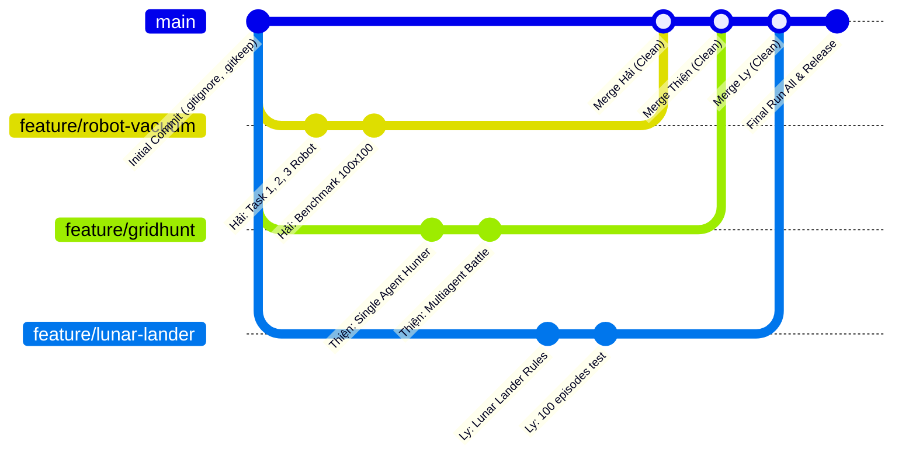

# KẾ HOẠCH PHÂN CHIA CÔNG VIỆC BÀI TẬP THỰC HÀNH LAB 01
**Môn học:** Trí tuệ Nhân tạo Nâng cao (AI Advance)  
**Chủ đề:** Tác tử Thông minh (Intelligent Agents)  
**Thành viên nhóm (3 người):** Hải, Thiện, Ly  

---

## I. NGUYÊN TẮC VÀNG ĐỂ TRÁNH CONFLICT GIT (QUAN TRỌNG)

> [!CAUTION]
> **Rủi ro lớn nhất:** File Jupyter Notebook (`.ipynb`) được lưu dưới dạng JSON chứa số thứ tự chạy (`execution_count`), metadata và output. Nếu **2 người cùng sửa chung 1 file notebook**, Git sẽ bị **conflict 100%** và rất khó merge thủ công.

Để **triệt tiêu hoàn toàn nguy cơ conflict**, nhóm thống nhất quy tắc:
1. **Phân quyền sở hữu độc quyền (1 File - 1 Owner):** Mỗi thành viên chỉ phụ trách và chỉnh sửa các file notebook được giao. Tuyệt đối không can thiệp vào file notebook của người khác.
2. **Quy tắc tạo nhánh (Branching Strategy):**
   - Nhánh `main`: Nhánh gốc ổn định, không commit trực tiếp code nháp lên `main`.
   - Mỗi người làm việc trên 1 branch riêng biệt:
     - Hải: `feature/robot-vacuum`
     - Thiện: `feature/gridhunt`
     - Ly: `feature/lunar-lander`
3. **Quy tắc trước khi nộp / Merge vào `main`:**
   - Mỗi thành viên chạy `Runtime -> Restart Kernel and Run All Cells` trên notebook của mình, kiểm tra không có cell nào bị lỗi đỏ (`Error`).
   - Tạo Pull Request (PR) hoặc merge vào nhánh `main`. Do mỗi người sửa một file riêng biệt, Git sẽ merge tự động 100% không bao giờ bị xung đột code.

---

## II. BẢNG PHÂN CHIA CÔNG VIỆC TỔNG QUAN

| Thành viên | Trọng tâm phụ trách | File code phụ trách chính | Nhiệm vụ lý thuyết (PEAS) | Nhiệm vụ tổng hợp & Điều phối |
| :--- | :--- | :--- | :--- | :--- |
| **Hải** | **Bài 2: Robot Hút Bụi** (Randomized, Simple Reflex, Model-Based) | `robot_vacuum.ipynb` | PEAS Bài 1.1 (Robot hút bụi) | Đo đạc benchmark 3 kích thước phòng ($5\times 5, 10\times 10, 100\times 100$) |
| **Thiện** | **Bài 3 & Bài 4: GridHunt** (Đơn tác tử & Đa tác tử cạnh tranh) | `gridhunt_mini_assignment.ipynb`<br>`gridhunt_multiagent_mini_assignment.ipynb` | PEAS Bài 1.2 (GridHunt đơn & đa tác tử) | Thiết kế $\ge 2$ chiến lược thợ săn đấu đối kháng, phân tích tác động `teleport` |
| **Ly** | **Bài 5: Lunar Lander** (Gymnasium) & **Lead Quản lý/Báo cáo** | `lunar_lander.ipynb`<br>`gymnasium_display_recorder.py` | PEAS Bài 1.3 (Lunar Lander) | Quản lý Git, tổng hợp báo cáo chung, review chéo và kiểm thử `Run All` |

---

## III. CHI TIẾT CÔNG VIỆC TỪNG THÀNH VIÊN

### 1. Thành viên: HẢI
* **Trách nhiệm chính:** Toàn bộ **Bài 2: Robot hút bụi** và **Bài 1.1** trong [assignment.md](file:///D:/dai_hoc/nam4/HK7/AI_advance/buoi2/lab01%20-%20Agent/assignment.md).
* **Branch Git:** `feature/robot-vacuum`
* **File làm việc:** [robot_vacuum.ipynb](file:///D:/dai_hoc/nam4/HK7/AI_advance/buoi2/lab01%20-%20Agent/robot_vacuum.ipynb)
* **Các đầu việc cụ thể:**
  - [ ] **Bài 1.1:** Xác định 4 thành phần PEAS của Robot hút bụi và phân loại môi trường (Quan sát một phần/toàn phần, Tất định/Ngẫu nhiên, Đơn tác tử/Đa tác tử...).
  - [ ] **Task 1 (Simulation Environment):** Hoàn thiện môi trường phòng $n \times n$, cảm biến va chạm `bumpers` 4 hướng, cảm biến `dirty`, hàm hiển thị trực quan (`display_environment`). Chạy demo kiểm tra với `simple_randomized_agent` (ngân sách 20 bước).
  - [ ] **Task 2 (Simple Reflex Agent):** Cài đặt tác tử phản xạ đơn giản (nếu dirty thì suck, không đi vào tường, chọn hướng hợp lệ).
  - [ ] **Task 3 (Model-Based Reflex Agent):** Cài đặt tác tử phản xạ có bộ nhớ/trạng thái bên trong (ghi nhớ tọa độ/bản đồ đã đi, duyệt quét sạch phòng có hệ thống).
  - [ ] **Task 4 (Simulation Study):** Thực nghiệm so sánh 3 tác tử trên 3 kích thước $5\times 5$, $10\times 10$, $100\times 100$ (chạy 100 lần mỗi cấu hình). Lập bảng số liệu trung bình và vẽ biểu đồ matplotlib.
  - [ ] **Task 5 & Advanced Task:** Trả lời phần tính bền vững (Robustness) và giải quyết trường hợp cảm biến bẩn bị nhiễu (Imperfect Dirt Sensor).

---

### 2. Thành viên: THIỆN
* **Trách nhiệm chính:** Toàn bộ **Bài 3 (GridHunt đơn tác tử)**, **Bài 4 (GridHunt đa tác tử)** và **Bài 1.2** trong [assignment.md](file:///D:/dai_hoc/nam4/HK7/AI_advance/buoi2/lab01%20-%20Agent/assignment.md).
* **Branch Git:** `feature/gridhunt`
* **File làm việc:**
  - [gridhunt_mini_assignment.ipynb](file:///D:/dai_hoc/nam4/HK7/AI_advance/buoi2/lab01%20-%20Agent/gridhunt_mini_assignment.ipynb)
  - [gridhunt_multiagent_mini_assignment.ipynb](file:///D:/dai_hoc/nam4/HK7/AI_advance/buoi2/lab01%20-%20Agent/gridhunt_multiagent_mini_assignment.ipynb)
* **Các đầu việc cụ thể:**
  - [ ] **Bài 1.2:** Xác định 4 thành phần PEAS của bài toán GridHunt (Performance, Environment, Actuators, Sensors) và đặc tính môi trường.
  - [ ] **GridHunt Đơn tác tử (Bài 3):**
    - Chạy tác tử thợ săn ngẫu nhiên làm baseline (ghi nhận số bước bắt quái vật).
    - Cài đặt tác tử phản xạ dựa trên mô hình: Dùng hành động `listen` để lấy vị trí quái vật, ghi nhớ vị trí và di chuyển thông minh nhằm rút ngắn khoảng cách (Manhattan distance).
    - Chạy thực nghiệm 100 lần trên đấu trường $10\times 10$ và $30\times 30$; thống kê tỷ lệ bắt thành công (%) và số bước trung bình.
    - Viết nhận xét: Khi nào `teleport` mang lại lợi thế, khi nào có hại và tác động của kích thước đấu trường.
  - [ ] **GridHunt Đa tác tử (Bài 4):**
    - Cho tác tử thợ săn đấu với thợ săn ngẫu nhiên trong 100 trận, thống kê số trận thắng.
    - Xây dựng ít nhất 2 chiến lược thợ săn khác nhau (ví dụ: Greedy Hunter vs Predictive/Interception Hunter) và cho đối đầu trực tiếp.
    - Thử nghiệm trên đấu trường $20\times 20$ và $\ge 30\times 30$.
    - Đề xuất giải pháp biến môi trường cạnh tranh thành hợp tác (ví dụ cơ chế chia sẻ tọa độ quái vật giữa 2 thợ săn).

---

### 3. Thành viên: LY
* **Trách nhiệm chính:** **Bài 5 (Lunar Lander trên Gymnasium)**, **Bài 1.3** và vai trò **Lead Quản lý Git & Tổng hợp Báo cáo**.
* **Branch Git:** `feature/lunar-lander`
* **File làm việc:**
  - [lunar_lander.ipynb](file:///D:/dai_hoc/nam4/HK7/AI_advance/buoi2/lab01%20-%20Agent/lunar_lander.ipynb)
  - [gymnasium_display_recorder.py](file:///D:/dai_hoc/nam4/HK7/AI_advance/buoi2/lab01%20-%20Agent/gymnasium_display_recorder.py)
  - File báo cáo chung (Word/PDF/Markdown) và [README.md](file:///D:/dai_hoc/nam4/HK7/AI_advance/buoi2/lab01%20-%20Agent/README.md)
* **Các đầu việc cụ thể:**
  - [ ] **Bài 1.3:** Xác định PEAS của Lunar Lander (không gian quan sát 8 chiều, 4 hành động rời rạc).
  - [ ] **Lunar Lander Reflex Agent (Bài 5):**
    - Chạy tác tử ngẫu nhiên baseline và ghi lại reward.
    - Cài đặt Simple Reflex Agent: Kích hoạt động cơ chính khi tốc độ rơi theo trục thẳng đứng vượt quá ngưỡng an toàn.
    - Cải tiến luật điều khiển nâng cao: Điều khiển động cơ trái/phải dựa trên độ lệch tọa độ ngang ($x$), vận tốc ngang ($v_x$) và góc nghiêng ($\theta, \omega$) của tàu.
    - Đánh giá trên 100 episode cho từng tác tử: Báo cáo reward trung bình, độ ổn định (độ lệch chuẩn / tỷ lệ tiếp đất thành công) và xuất video demo.
    - Viết phân tích lý thuyết: Vì sao tác tử phản xạ luật cục bộ khó đạt điểm tối ưu trong môi trường liên tục như Lunar Lander.
  - [ ] **Nhiệm vụ Quản lý & Tổng hợp (Reviewer & Coordinator):**
    - Đảm bảo các file `.gitignore` và `.gitkeep` hoạt động chuẩn xác, không để file rác/video nặng bị push lên repo.
    - Hỗ trợ review Pull Request của Hải và Thiện trước khi merge vào `main`.
    - Kiểm tra tổng thể: Clone repo ra một thư mục sạch hoặc chạy thử `Run All Cells` trên cả 4 notebook để đảm bảo không có lỗi phát sinh.
    - Gom báo cáo, định dạng hình ảnh/biểu đồ chuẩn chỉn theo yêu cầu môn học.

---

## IV. QUY TRÌNH PHỐI HỢP GIT HẰNG NGÀY



1. **Bắt đầu làm bài:**
   ```bash
   git checkout main
   git pull origin main
   git checkout -b feature/<ten-nhanh-cua-minh>
   ```
2. **Lưu tiến độ làm việc:**
   ```bash
   git add <ten-file-notebook-cua-minh>
   git commit -m "feat: mo ta noi dung da lam"
   git push origin feature/<ten-nhanh-cua-minh>
   ```
3. **Khi hoàn thành:**
   - Thông báo cho Ly (Reviewer).
   - Mở Pull Request trên GitHub để merge nhánh của mình vào `main`.
   - Ly kiểm tra nhanh và nhấn **Merge** (Đảm bảo tự động thành công do không sửa đè file của nhau).
