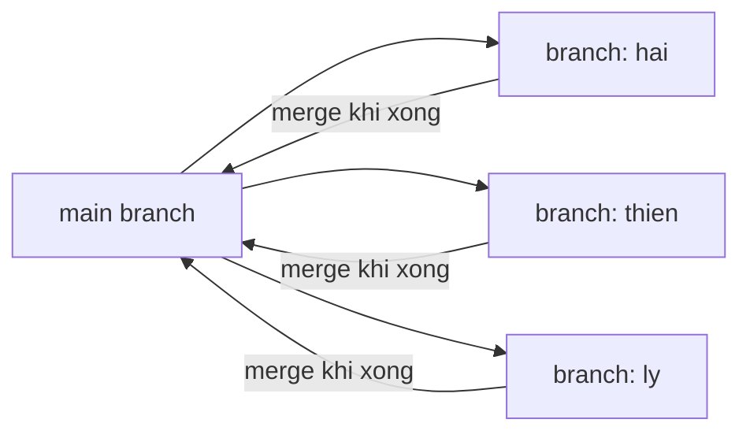
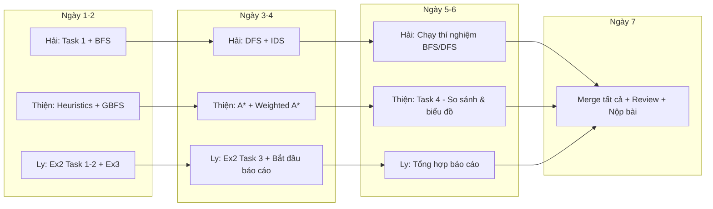

# 📋 Phân Công Nhiệm Vụ - Lab02: Giải Quyết Vấn Đề Bằng Tìm Kiếm

## Mục tiêu
Phân công nhiệm vụ cho 3 thành viên (**Hải**, **Thiện**, **Ly**) để hoàn thành Lab02 - Searching. Mỗi người làm trên **1 nhánh Git riêng**, tránh conflict khi merge.

## Chiến lược chia nhánh & tránh conflict



> [!IMPORTANT]
> **Nguyên tắc tránh conflict:**
> - Mỗi người chỉ chỉnh sửa **file notebook của mình** (không chạm file của người khác).
> - File `maze_helper.py` và các file `*.txt` là **file dùng chung, KHÔNG ĐƯỢC SỬA**.
> - Nếu cần thêm hàm tiện ích, tạo file riêng trong thư mục của mình (ví dụ: `utils_hai.py`).
> - Báo cáo Word/PDF do **1 người duy nhất** tổng hợp cuối cùng (Ly).

---

## Phân công chi tiết

### 🔵 Hải — Nhánh: `hai`
**File phụ trách:** `Ex1_Maze.ipynb` (Phần Task 1 + Task 2)

| STT | Nhiệm vụ | Chi tiết | Điểm |
|-----|-----------|----------|------|
| 1 | **Task 1**: Định nghĩa bài toán tìm kiếm | - Xác định 5 thành phần: Initial state, Actions, Transition model, Goal state, Path cost<br>- Ước lượng n, d, m, b cho các maze | 10 |
| 2 | **Task 2**: Implement BFS & DFS | - Cài đặt BFS (Breadth-First Search) theo pseudocode<br>- Cài đặt DFS (Depth-First Search) theo pseudocode<br>- Trả lời câu hỏi: BFS/DFS xử lý loop thế nào?<br>- Thảo luận tính complete, optimal, time/space complexity | 40 |
| 3 | **Advanced**: IDS & Multiple Goals | - Implement IDS (Iterative Deepening Search) dựa trên DFS<br>- Tạo maze nhiều đích và test DFS, BFS, IDS | 10 |
| 4 | Chạy thí nghiệm BFS/DFS | - Chạy BFS & DFS trên tất cả maze (small, medium, large, open, L, loops, empty, empty_2)<br>- Thu thập: path cost, nodes expanded, max depth, max frontier, thời gian<br>- Ghi kết quả vào bảng trong notebook | — |

**Tổng điểm phụ trách: 60 điểm** (+ 10 advanced)

#### Hướng dẫn kỹ thuật cho Hải:
```python
# BFS - Sử dụng Queue (FIFO) cho frontier
from collections import deque

def bfs(maze, start, goal):
    frontier = deque()  # FIFO queue
    frontier.append(Node(start, None, None, 0))
    reached = {start}
    nodes_expanded = 0
    max_frontier = 0
    max_depth = 0
    # ... implement theo pseudocode Fig 3.7 textbook
    
# DFS - Sử dụng Stack (LIFO) cho frontier
def dfs(maze, start, goal):
    frontier = []  # Stack (LIFO)
    frontier.append(Node(start, None, None, 0))
    # ... implement theo pseudocode

# IDS - Gọi DFS với depth limit tăng dần
def ids(maze, start, goal):
    for depth_limit in range(0, max_possible_depth):
        result = depth_limited_dfs(maze, start, goal, depth_limit)
        if result is not None:
            return result
```

---

### 🟢 Thiện — Nhánh: `thien`
**File phụ trách:** `Ex1_Maze.ipynb` (Phần Task 3 + Task 4)

> [!WARNING]
> **Để tránh conflict với Hải:** Thiện làm việc ở **phần cuối** của Ex1_Maze.ipynb (từ Cell 38 trở đi — Task 3, Task 4, và phần Advanced Weighted A*). Hải làm **phần đầu** (Cell 28-37 — Task 1, Task 2). **Quy ước quan trọng:**
> - Hải chỉ chỉnh sửa các cell từ **Cell 29 đến Cell 37** (Task 1 + Task 2)
> - Thiện chỉ chỉnh sửa các cell từ **Cell 39 đến Cell 58** (Task 3 + Task 4 + Advanced)
> - **KHÔNG** ai được thêm/xóa cell ở phần của người kia
> - Sau khi cả hai hoàn thành, **merge nhánh `hai` trước**, rồi merge nhánh `thien` (resolve conflict nếu có bằng cách giữ cả 2 phần)

| STT | Nhiệm vụ | Chi tiết | Điểm |
|-----|-----------|----------|------|
| 1 | **Task 3**: Implement GBFS & A* | - Cài đặt heuristic Manhattan & Euclidean<br>- Implement Greedy Best-First Search (GBFS) dùng h(n)<br>- Implement A* Search dùng f(n) = g(n) + h(n)<br>- Thảo luận complete, optimal, complexity | 20 |
| 2 | **Task 4**: So sánh & thảo luận | - Chạy thí nghiệm tất cả thuật toán trên tất cả maze<br>- Điền bảng kết quả cho small/medium/large/open/L/loops/empty maze<br>- Tạo biểu đồ so sánh (bar charts)<br>- Viết thảo luận bài học quan trọng | 20 |
| 3 | **Advanced**: Weighted A* | - Implement Weighted A*: f(n) = g(n) + w·h(n)<br>- Thay đổi w và quan sát ảnh hưởng | bonus |

**Tổng điểm phụ trách: 40 điểm** (+ bonus Weighted A*)

#### Hướng dẫn kỹ thuật cho Thiện:
```python
import heapq
import math

# Heuristic functions
def manhattan(pos, goal):
    return abs(pos[0] - goal[0]) + abs(pos[1] - goal[1])

def euclidean(pos, goal):
    return math.sqrt((pos[0] - goal[0])**2 + (pos[1] - goal[1])**2)

# GBFS - Priority Queue dùng h(n)
def gbfs(maze, start, goal):
    frontier = []  # min-heap
    heapq.heappush(frontier, (manhattan(start, goal), Node(start, None, None, 0)))
    reached = {start}
    # ... expand node có h(n) nhỏ nhất

# A* - Priority Queue dùng f(n) = g(n) + h(n)
def astar(maze, start, goal, heuristic=manhattan):
    frontier = []
    start_node = Node(start, None, None, 0)
    f = 0 + heuristic(start, goal)
    heapq.heappush(frontier, (f, start_node))
    reached = {start: 0}  # state -> best g(n) found
    # ... expand node có f(n) nhỏ nhất

# Weighted A* 
def weighted_astar(maze, start, goal, w=1.0, heuristic=manhattan):
    # f(n) = g(n) + w * h(n)
    pass
```

> [!TIP]
> **Lưu ý cho Task 4:** Thiện cần import/gọi lại hàm BFS, DFS của Hải để chạy so sánh. Sau khi merge nhánh `hai`, các hàm BFS/DFS sẽ có sẵn trong notebook.

---

### 🟡 Ly — Nhánh: `ly`
**File phụ trách:** `Ex2_Maze_simplified.ipynb` + `Ex3_Show_all_mazes.ipynb` + **Báo cáo tổng hợp**

| STT | Nhiệm vụ | Chi tiết | Điểm |
|-----|-----------|----------|------|
| 1 | **Ex2 - Task 1**: Định nghĩa bài toán | - Xác định 5 thành phần tìm kiếm cho maze<br>- Ước lượng kích thước bài toán | 2 |
| 2 | **Ex2 - Task 2**: Implement BFS | - Cài đặt BFS trong Ex2_Maze_simplified.ipynb<br>- Chạy trên small, large, open, empty maze<br>- Tạo visualization đường đi | 5 |
| 3 | **Ex2 - Task 3**: Thảo luận | - Complete & optimal?<br>- Time & space complexity<br>- Tại sao BFS không scale cho bài toán lớn? | 3 |
| 4 | **Ex3**: Hoàn thiện Show all mazes | - Hoàn thiện Ex3_Show_all_mazes.ipynb<br>- Hiển thị tất cả maze kèm thông tin (kích thước, start, goal) | — |
| 5 | **Báo cáo tổng hợp** | - Tạo báo cáo Word/PDF: trang bìa, mục lục<br>- Tổng hợp kết quả từ Hải & Thiện<br>- Viết nhận xét 1-2 trang<br>- Thêm ≥2 hình/animation minh họa<br>- Chèn bảng kết quả so sánh | — |

**Tổng điểm phụ trách: 10 điểm** (Ex2) + Báo cáo tổng hợp

#### Hướng dẫn kỹ thuật cho Ly:
```python
# Ex2 - BFS (phiên bản đơn giản, chỉ cần BFS)
from collections import deque

def bfs(maze, start, goal):
    frontier = deque([Node(start, None, None, 0)])
    reached = {start}
    
    while frontier:
        node = frontier.popleft()
        if node.pos == goal:
            return node.get_path_from_root()
        
        for action, neighbor in get_neighbors(maze, node.pos):
            if neighbor not in reached:
                reached.add(neighbor)
                child = Node(neighbor, node, action, node.cost + 1)
                frontier.append(child)
    return None

# Ex3 - Show all mazes
# Hoàn thiện code hiển thị tất cả maze với thông tin chi tiết
```

---

## Quy trình làm việc Git

### Bước 1: Tạo nhánh (mỗi người chạy trên máy mình)
```bash
# Hải
git checkout main
git pull origin main
git checkout -b hai

# Thiện  
git checkout main
git pull origin main
git checkout -b thien

# Ly
git checkout main
git pull origin main
git checkout -b ly
```

### Bước 2: Làm việc & commit thường xuyên
```bash
# Ví dụ cho Hải
git add Ex1_Maze.ipynb
git commit -m "Task 1: Define search problem components"
git push origin hai
```

### Bước 3: Merge theo thứ tự (sau khi tất cả hoàn thành)
```bash
# 1. Merge nhánh ly trước (Ex2, Ex3 - không conflict với Ex1)
git checkout main
git merge ly

# 2. Merge nhánh hai (Ex1 phần đầu)
git merge hai

# 3. Merge nhánh thien (Ex1 phần sau - có thể cần resolve)
git merge thien
# Nếu conflict ở Ex1_Maze.ipynb: giữ cả 2 phần (Task 1+2 của Hải + Task 3+4 của Thiện)
```

> [!CAUTION]
> **Notebook (.ipynb) conflict rất khó resolve!** Để an toàn nhất:
> 1. **Hải hoàn thành và merge trước**
> 2. **Thiện pull main** (đã có code Hải), rồi thêm code Task 3+4 vào, commit và merge
> 3. **Ly** làm file riêng nên không conflict
>
> Hoặc cách an toàn hơn: Hải và Thiện **trao đổi code qua file `.py` riêng** (ví dụ `search_algorithms.py`), rồi 1 người tổng hợp import vào notebook.

---

## Timeline đề xuất



---

## Bảng tóm tắt phân công

| Thành viên | Nhánh Git | File chính | Nhiệm vụ | Điểm |
|------------|-----------|------------|-----------|------|
| **Hải** | `hai` | Ex1 (Cell 29-37) | Task 1 + Task 2 (BFS, DFS) + Advanced (IDS, Multiple Goals) | 60 + 10 |
| **Thiện** | `thien` | Ex1 (Cell 39-58) | Task 3 (GBFS, A*) + Task 4 (So sánh) + Advanced (Weighted A*) | 40 + bonus |
| **Ly** | `ly` | Ex2 + Ex3 + Báo cáo | Ex2 (BFS simplified) + Ex3 (Show mazes) + Báo cáo tổng hợp | 10 + báo cáo |

---

## Sản phẩm nộp (checklist)

- [ ] `Ex1_Maze.ipynb` — hoàn thiện (Hải + Thiện)
- [ ] `Ex2_Maze_simplified.ipynb` — hoàn thiện (Ly)
- [ ] `Ex3_Show_all_mazes.ipynb` — hoàn thiện (Ly)
- [ ] Bảng kết quả so sánh BFS, DFS, GBFS, A* trên ≥3 maze
- [ ] ≥2 hình/animation minh họa đường đi
- [ ] Nhận xét 1-2 trang (completeness, optimality, time, memory, heuristic, cycle checking)
- [ ] Báo cáo PDF: trang bìa, mục lục, họ tên + MSSV từng thành viên
- [ ] Code chạy được từ đầu, không lỗi, không debug output thừa

## Open Questions

> [!IMPORTANT]
> 1. **Cell phân chia trong Ex1_Maze.ipynb**: Hải và Thiện cùng sửa 1 file notebook → nguy cơ conflict cao. Bạn có muốn tôi tách thành 2 file riêng (`Ex1_Part1_Hai.ipynb` và `Ex1_Part2_Thien.ipynb`) rồi merge lại sau không?
> 2. **Báo cáo**: Ly dùng Word hay LaTeX? Cần template sẵn không?
> 3. **Hàm dùng chung** (ví dụ `get_neighbors`, `Node` class): Có nên tạo file `search_utils.py` chung để cả 3 import không? Nếu có, file này thuộc ai quản lý?
